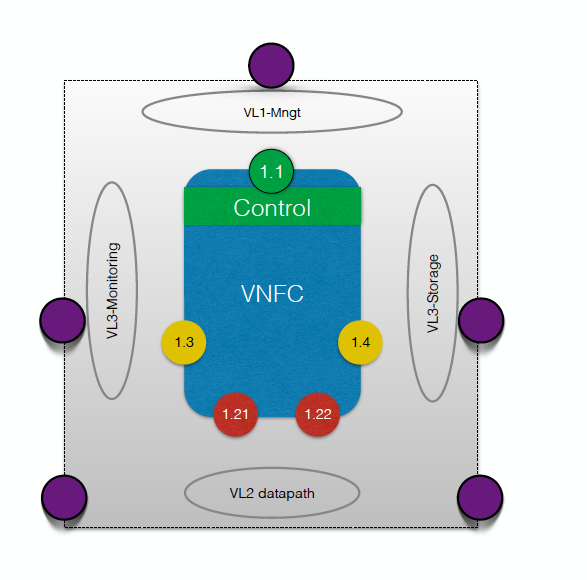

#T-NOVA Descriptor Repository
##Introduction
This repository contains the templates and example descriptors used in Project T-NOVA. The current folder structure contains: 

* ETSI defined descriptors (etsi_<descriptor_name>)
* T-NOVA defined descriptors (t-nova_<descriptor_name>)
* Example descriptors for a Network Service containing a single VNF comprised of 2 VNFCs. (example_<descriptor_name>)
* T-NOVA VNFs descriptor files (<vnf_name>_<descriptor_name>)

##Descriptors
###ETSI Descriptors
Current ETSI ISG NFV proposal as laid out in [ETSI GS NFV-MAN 001 v 1.1.1](http://www.etsi.org/deliver/etsi_gs/NFV-MAN/001_099/001/01.01.01_60/gs_NFV-MAN001v010101p.pdf "click to download")
#### Definitions 
 As suggested by ETSI documentation the relation model for a VNFD is illustrated in the following 

###T-NOVA Descriptors
Project related sections have been added in order to acommodate its developements and requirements. Notably you may find additional sections for the Marketplace, Monitoring, EPA and VNF configuration. 

###Example Descriptors

####Introduction 
This set of descriptors serve as an example for the definition of the appropriate VNFD and NSD required for the composotion of a NS comprised by a  **single dataplane VNF** in this case a Virtual Traffic Classifier VNF. The basic functionality of the VNF is to accept incoming packets (data-in) analyse heade and payload information and forward the traffic (_data-out_) after the appropriate marking/prioritisation policies have been places on the packets categorised under certain service/application categories. 
 
 The VNFD and NSD are based on the . 
 
####Definitions

 
 
 In order to simplify the model it is assumed that each VDU contains only one VNFC. 
 
####VNF Architecture 
 
 
##### VNF Requirements
1. Data In interface 
2. Data Out Interface
3. VNFC1 - VNFC2 interconnection 
4. Public IP for the VNFC1 (management)
5. at least 1 Core per VNFC and 2G RAM 
6. 4 vNICs per VNFC
#### VNF Monitoring  
Simple implementation of the integrated monitoring deamon as proposed
#### VNF Configuration  
* VNFC1 IP address using dhcp 
* 

 
####Deployment Model  
####Assumptions  
 
1.	NS comprises a single VNF 
2.	A vdu comprises of a single VNFC 
3.	The network model for VNF deployment assumes the creation of 4 tenant networks namely: 
 	*	Management: used for internal management communication and signaling 
	*	Monitoring: used for the monitoring agent communications with the VNFC
	*	Storage: used for connecting VNFC to persistent or non-persistent storage 
	*	Datapath: used for the data that traverse the VNFC
	 
### T-NOVA VNFs Descriptors 
For T-NOVA  four VNFs are currently anticipated 

* Virtual Traffic Classifier (vTC)
* Virtual Security Appliance (vSA)
* Virtual Session Border Controller (vSBC) 
* Virtual Home Gateway (vHG)

#	#Openstack Orchestration templates (HEAT)
Some preliminary examples have been included under the 'HEAT' directory in the repository. 

##References 

1. [Terminology for Main Concepts in NFV - ETSI GS NFV 003 V1.2.1 (2014-12)](http://www.etsi.org/deliver/etsi_gs/NFV/001_099/003/01.02.01_60/gs_NFV003v010201p.pdf "link") 
2. [Management and Orchestration - ETSI GS NFV-MAN 001 V1.1.1 (2014-12)](http://www.etsi.org/deliver/etsi_gs/NFV-MAN/001_099/001/01.01.01_60/gs_NFV-MAN001v010101p.pdf "link")
3. [Virtual Network Functions Architecture - ETSI GS NFV-SWA 001 V1.1.1 (2014-12)](http:// "link") 
